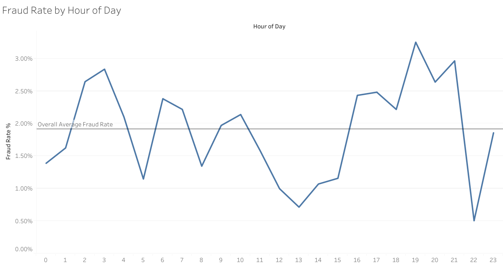

# Digital Payments & Fraud Analysis

This project analyses transaction data to identify fraud patterns, risk exposure, and time-based fraud behaviour using SQL (BigQuery) and Tableau.

## 📊 Executive Summary

| Metric | Value |
|--------|--------|
| Total Transactions | 10,000 |
| Total Transaction Value | £2,560,642.79 |
| Overall Fraud Rate | 1.91% |
| Fraud Value Exposure | 1.71% |
| Peak Fraud Hour | 19:00 |
| Fraud Rate at Peak Hour | 3.25% |

## 🧠 Business Problem

Digital payment platforms must monitor fraud exposure while maintaining seamless transaction flow. 

The objective of this analysis is to:
- Measure fraud frequency and financial exposure
- Identify high-risk transaction periods
- Detect behavioural fraud patterns
- Provide data-driven risk mitigation recommendations

## 📈 Hourly Transaction Distribution

The chart below shows transaction volume across the day, highlighting peak usage periods.

.

Second Chart (Stronger)

## 🚨 Fraud Rate by Hour

Fraud activity increases disproportionately during evening hours, with a peak fraud rate of 3.25% at 19:00 — significantly above the daily average of 1.91%.

.

## 🔍 Key Insights

- Fraud accounts for 1.91% of total transactions.
- Fraud represents 1.71% of total transaction value.
- Fraud transactions are slightly lower in average value than normal transactions.
- Fraud risk increases significantly during evening hours.
- The 19:00 hour shows a fraud rate nearly 70% higher than the daily average.

## 💡 Business Recommendations

- Increase fraud monitoring intensity during peak evening hours (18:00–21:00).
- Apply time-based risk scoring adjustments.
- Monitor fraud rate trends rather than transaction volume alone.
- Investigate behavioural clustering among high-risk users.
