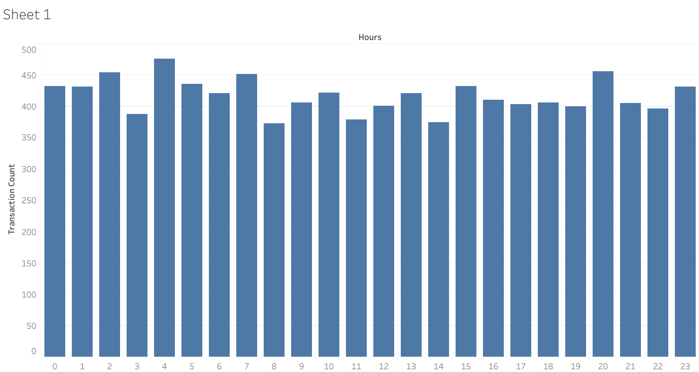

# digital-payments-fraud-analysis
## 📖 Project Overview

This project analyses digital payment transactions to evaluate fraud exposure, transaction performance, and user behaviour.

The objective is to simulate a real-world fintech scenario where management wants to understand:

- Total transaction volume
- Revenue exposure
- Fraud rate
- High-risk patterns
- User activity distribution

The analysis was performed using Google BigQuery (SQL).

---

## 🗂 Dataset Description

The dataset contains 10,000 simulated payment transactions with the following fields:

- transaction_id – Unique transaction identifier  
- user_id – Customer identifier  
- time – Time of transaction (seconds within a 24-hour period)  
- amount – Transaction value (£)  
- class – Fraud flag (0 = normal, 1 = fraud)  

---

## 🧹 Data Cleaning & Preparation

The following validation checks were performed:
- Verified no missing values in key columns  
- Confirmed fraud flag contains only binary values (0 and 1)  
- Checked transaction amounts for unrealistic or negative values  
- Converted time (seconds) into hourly buckets for time-based analysis  

---

## 📊 Key Business Questions

1. What is the total number of transactions?
2. What is the total transaction value?
3. What is the fraud rate?
4. What percentage of transaction value is fraudulent?
5. At what time of day does fraud occur most frequently?
6. Are fraud transactions higher value than normal transactions?

---

## 📈 Key Insights

- The dataset contains 10,000 transactions with a total processed value of £2,560,642.79.
- Fraud accounts for 1.91% of total transactions.
- Fraud represents 1.71% of total transaction value.
- The average fraud transaction (£229.11) is slightly lower than the average normal transaction (£256.59).
- Fraud activity peaks at 19:00

## 💡 Business Recommendations

- Maintain monitoring systems even for lower-value transactions, as fraud is not limited to high-value transfers.
- Implement automated fraud detection rules based on behavioural patterns rather than transaction size alone.
- Monitor fraud rate trends over time to detect sudden spikes in exposure.
- Conduct further segmentation analysis (e.g., by user or time of day) to identify concentrated risk patterns.
- Increase fraud monitoring intensity during peak evening hours (18:00-21:00)

---

## 🛠 Tools Used

- Google BigQuery (SQL)
- GitHub

1️⃣ Project Title (Top of File)

# Digital Payments & Fraud Analysis

This project analyses transaction data to identify fraud patterns, risk exposure, and time-based fraud behaviour using SQL (BigQuery) and Tableau.

## 📊 Executive Summary

| Metric | Value |
|--------|--------|
| Total Transactions | 10,000 |
| Total Transaction Value | £2,560,642.79 |
| Overall Fraud Rate | 1.91% |
| Fraud Value Exposure | 1.71% |
| Peak Fraud Hour | 19:00 |
| Fraud Rate at Peak Hour | 3.25% |

## 🧠 Business Problem

Digital payment platforms must monitor fraud exposure while maintaining seamless transaction flow. 

The objective of this analysis is to:
- Measure fraud frequency and financial exposure
- Identify high-risk transaction periods
- Detect behavioural fraud patterns
- Provide data-driven risk mitigation recommendations

## 📈 Hourly Transaction Distribution

The chart below shows transaction volume across the day, highlighting peak usage periods.

.

Second Chart (Stronger)

## 🚨 Fraud Rate by Hour

Fraud activity increases disproportionately during evening hours, with a peak fraud rate of 3.25% at 19:00 — significantly above the daily average of 1.91%.

📌 Charts always go inside the analysis section — never at the top.

5️⃣ 🔍 Key Insights

After visuals, you explain what they mean:

## 🔍 Key Insights

- Fraud accounts for 1.91% of total transactions.

- Fraud represents 1.71% of total transaction value.

- Fraud transactions are slightly lower in average value than normal transactions.

- Fraud risk increases significantly during evening hours.

- The 19:00 hour shows a fraud rate nearly 70% higher than the daily average.

6️⃣ 💡 Business Recommendations

Last section:

## 💡 Business Recommendations

- Increase fraud monitoring intensity during peak evening hours (18:00–21:00).

- Apply time-based risk scoring adjustments.

- Monitor fraud rate trends rather than transaction volume alone.

- Investigate behavioural clustering among high-risk users.
